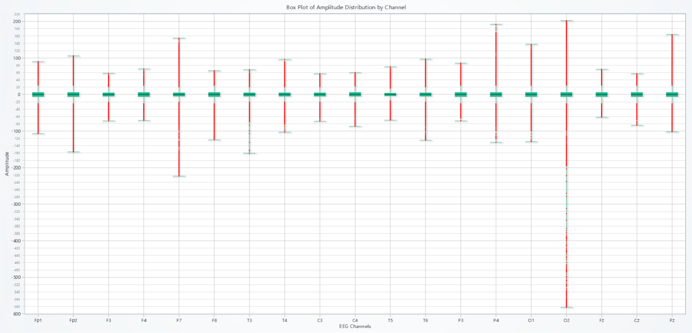
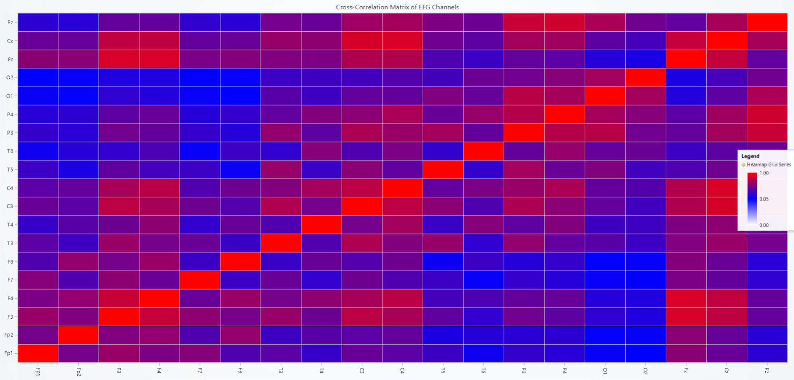
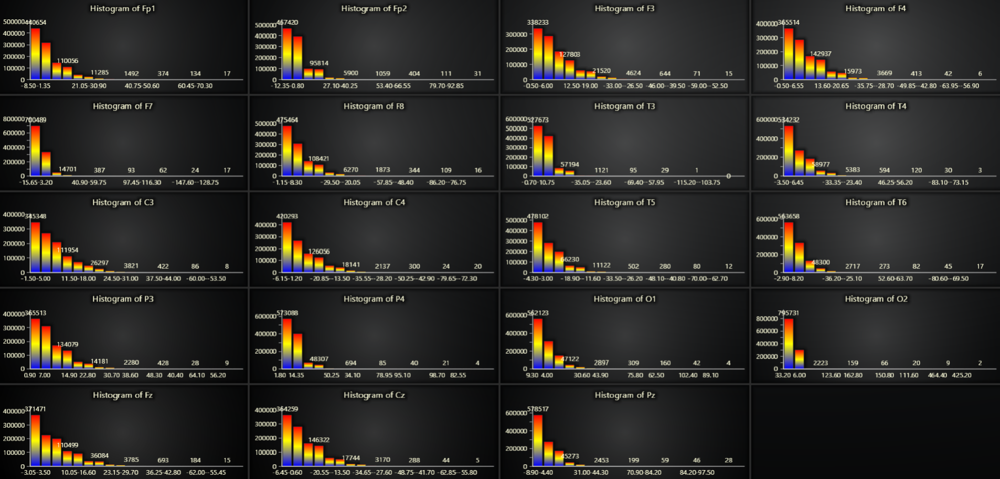
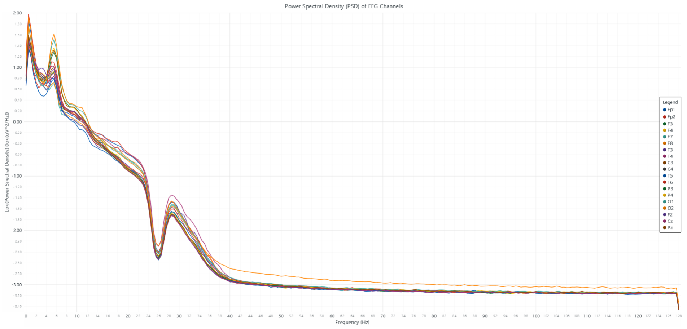
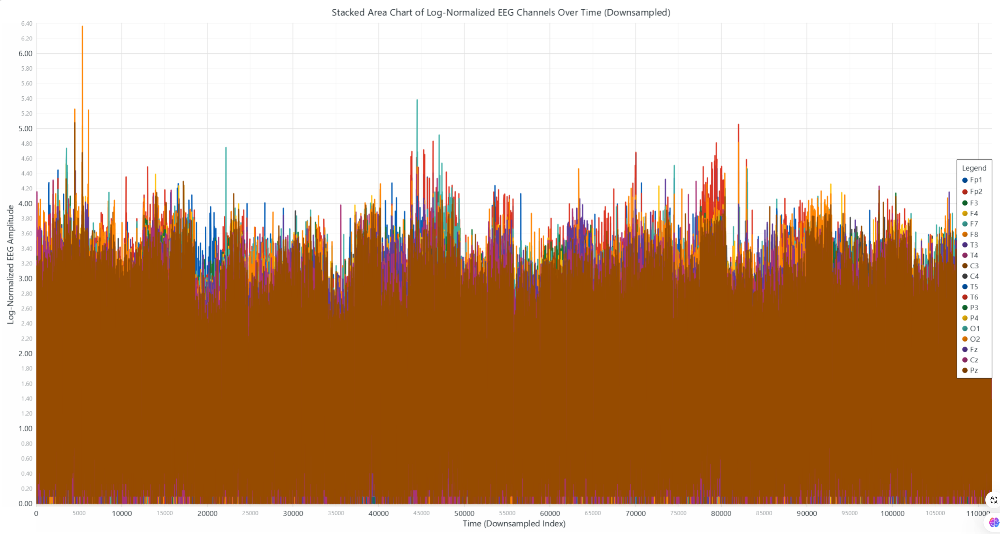

# 19-Channel EEG Data Analysis Tutorial with LightningChart Python

## Introduction to EEG Data Analysis 

### What is EEG?
Electroencephalography (EEG) is a non-invasive method used to measure electrical activity in the brain. It records brainwaves through electrodes placed on the scalp and has become an essential tool in neuroscience, medicine, and cognitive research.

### Applications of EEG in Neuroscience, Medicine, and Machine Learning
EEG is widely used in medical diagnostics to detect brain disorders like epilepsy, sleep disorders, and stroke. In neuroscience, it enables the study of brain functions during different tasks, such as mental arithmetic or visual processing. Recent advancements also use EEG in machine learning for brain-computer interfaces (BCI), enabling direct communication between the brain and external devices.

## EEG Signal Processing

### Relevance of EEG Data Analysis
EEG data analysis is critical for understanding brain activity patterns. It plays a central role in diagnosing neurological disorders, developing cognitive models, and improving BCI systems.

### What Are Multi-Channel EEG Signals?
Multi-channel EEG signals are simultaneous recordings from multiple electrodes placed across the scalp. In this project, we work with 19 channels based on the International 10-20 system, capturing a comprehensive view of brain activity.

### Challenges in Processing EEG Data
- **Noise and Artifacts**: EEG data is prone to noise from muscle movements, eye blinks, and external electrical sources.
- **High Dimensionality**: With multiple channels, the dataset becomes complex, requiring advanced visualization and analysis.
- **Real-Time Monitoring**: EEG often needs to be analyzed in real-time, demanding high-performance tools like LightningChart.

## EEG Signal Processing Techniques

### Filtering
High-pass and notch filters are essential for removing low-frequency drifts and powerline noise (e.g., 50 Hz).

### Fourier Transform
The Fourier Transform decomposes EEG signals into frequency components, aiding in the analysis of brainwave activity across delta, theta, alpha, beta, and gamma bands.

### Feature Extraction
Features like power spectral density (PSD) and amplitude variations help identify patterns in brain activity and detect anomalies.

## LightningChart Python

### Overview of LightningChart Python
LightningChart Python is a high-performance data visualization library designed for large, complex datasets. Its real-time rendering capabilities make it ideal for EEG analysis, providing smooth and interactive visualizations.

### Features and Chart Types to be Used in the Project
This project uses the following chart types:
1. **Box Plot**: Analyzes amplitude distributions across EEG channels.
2. **Heatmap**: Visualizes the correlation matrix of EEG channels.
3. **Histograms**: Shows amplitude distributions for individual channels.
4. **Power Spectral Density (PSD) Chart**: Displays the frequency spectrum of EEG signals.
5. **Stacked Area Chart**: Tracks normalized EEG amplitude over time.
6. **Real-Time 3D Visualization**: Simulates EEG activity on a brain model.

### Performance Characteristics
LightningChart excels at handling multi-channel EEG data due to:
- High rendering performance for large datasets.
- Support for real-time data visualization.
- Interactive features like zooming and panning, crucial for analyzing EEG signals.

## Setting Up Python Environment

### Installing Python and Necessary Libraries
Install the required libraries using the following commands:
```bash
pip install lightningchart==0.9.3
pip install lightningchart pandas numpy scipy
```

### Overview of Libraries Used
- **NumPy**: Efficient numerical operations.
- **Pandas**: Data handling and preprocessing.
- **LightningChart**: High-performance charting.
- **SciPy**: Signal processing tools for PSD analysis.

### Setting Up Your Development Environment
1. Set up your development environment by creating a virtual environment and installing the necessary libraries. This ensures that your project dependencies are isolated and manageable.

  ```bash
   python -m venv f1_env
   source f1_env/bin/activate  # Windows: f1_env\Scripts\activate
   pip install -r requirements.txt
   ```

2. **Using Visual Studio Code (VSCode)**: Visual Studio Code (VSCode) is a popular code editor that offers a rich set of features to enhance your development workflow.

---

## Loading and Processing Data

### Overview of the Dataset
The dataset consists of EEG recordings from subjects performing mental arithmetic tasks. It contains 19 channels following the International 10-20 system: Fp1, Fp2, F3, F4, F7, F8, T3, T4, C3, C4, T5, T6, P3, P4, O1, O2, Fz, Cz, Pz. Each channel records the amplitude of brain activity over 60 seconds.

### How to Load the Data Files
#### Loading Data
Load the EEG data using Pandas:
```python
import pandas as pd

file_path = 'Dataset/all_data_combined.csv'
data = pd.read_csv(file_path, header=None, names=channel_names, sep=',')
```

#### Handling and Preprocessing the Data
1. **Convert Data to Numeric**: Ensure all values are numeric, dropping missing values:
    ```python
    data = data.apply(pd.to_numeric, errors='coerce').dropna()
    ```
2. **Downsample the Data**: Aggregate data to reduce dimensionality for visualization:
    ```python
    downsampled_data = data.groupby(data.index // window_size).mean()
    ```

## Visualizing Data with LightningChart

LightningChart enables us to create a variety of visualizations to analyze telemetry data effectively. Let’s look at each chart created in this project and interpret the results.

### 1. **Box Plot: Amplitude Distribution Across Channels**

#### Description
The box plot displays the amplitude distribution for each EEG channel. The X-axis represents the EEG channels (e.g., Fp1, Fp2, F3, etc.), and the Y-axis shows the amplitude range. Each box represents the interquartile range (IQR) of the data for a channel, with the median marked inside. Outliers are plotted as individual red points, making it easy to spot abnormal amplitudes.

#### Results
- Channels like **T3** and **T6** exhibit broader amplitude ranges compared to others, indicating higher variability in those regions of the brain.
- Outliers in certain channels could signal artifacts or specific brain activities (e.g., mental effort during arithmetic tasks).
- Channels closer to the frontal lobe (e.g., Fp1, Fp2) have tighter IQRs, suggesting more consistent brain activity in these regions.

#### Use Cases
- **Artifact Detection**: Outliers could signify muscle movements or noise, which can be isolated for cleaning the data.
- **Comparing Brain Activity**: Understanding which regions of the brain are more active or variable during specific tasks.
- **Clinical Diagnostics**: Identifying unusual activity patterns for conditions like epilepsy.

**Script Summary**:
```python
chart = lc.ChartXY(title="Box Plot of Amplitude Distribution by Channel")
box_series = chart.add_box_series()
# Add data to the chart...
chart.open()
```



### 2. **Heatmap: Correlation Matrix of EEG Channels**

### Description
This heatmap visualizes the correlation coefficients between EEG channels. Channels with strong positive correlations are marked in red, and negative correlations are in blue. The X and Y axes represent EEG channels, and the grid cells indicate the degree of correlation.

### Results
- Channels like **F3-F4** and **C3-C4** (which are symmetrical across the brain) show strong positive correlations, as expected due to their spatial and functional proximity.
- Weak or negative correlations between distant channels (e.g., Fp1-T6) indicate less connectivity or interaction.
- Patterns in the correlation matrix highlight interdependencies among brain regions during cognitive tasks.

### Use Cases
- **Brain Connectivity Studies**: Analyze functional connectivity across regions for tasks like arithmetic or memory recall.
- **Feature Selection**: Correlated channels can be grouped to reduce redundancy in machine learning models.
- **Clinical Use**: Detect abnormal connectivity patterns, such as in traumatic brain injury or autism spectrum disorders.

**Script Summary**:
```python
heatmap_series = chart.add_heatmap_grid_series(columns=19, rows=19)
heatmap_series.invalidate_intensity_values(data.corr().to_numpy().tolist())
chart.open()
```



### 3. **Histograms: Amplitude Distributions for Each Channel**

### Description
Histograms show the amplitude distribution for individual EEG channels. Each chart represents a channel, with bins displaying the frequency of amplitude values within specific ranges. The intensity of color (from blue to red) reflects the density of values.

### Results
- Channels like **C3** and **C4** exhibit higher counts of mid-range amplitudes, indicating consistent activity.
- Frontal channels (**Fp1, Fp2**) show lower amplitudes compared to occipital regions (**O1, O2**), reflecting differences in brain activity patterns.
- Skewed distributions or sharp peaks may indicate dominant brainwave activity in specific channels.

### Use Cases
- **Analyzing Brainwave Dominance**: Identify dominant frequency ranges for specific channels.
- **Outlier Detection**: Detect unusual peaks caused by noise or artifacts.
- **Clinical Diagnostics**: Highlight amplitude patterns indicative of brain disorders like epilepsy or depression.

**Script Summary**:
```python
dashboard = lc.Dashboard(rows=5, columns=4)
dashboard.BarChart(...).set_data(...)
dashboard.open()

```


---

### 4. **Power Spectral Density (PSD) Analysis**

### Description
The PSD chart decomposes EEG signals into their frequency components using Welch’s method. The X-axis shows the frequency in Hz, and the Y-axis represents the logarithmic power spectral density (log(uV²/Hz)). Each line corresponds to a different channel.

### Results
- Channels exhibit peaks in the **alpha (8–12 Hz)** and **beta (12–30 Hz)** bands, indicating dominant brainwave activity during cognitive tasks.
- Higher activity in frontal channels (**Fp1, Fp2**) in the alpha band aligns with mental relaxation during arithmetic preparation.
- Variability in beta bands may indicate active problem-solving or concentration.

### Use Cases
- **Brainwave Analysis**: Study activity in alpha, beta, delta, and gamma bands for cognitive and emotional states.
- **Task Monitoring**: Detect changes in brainwave activity during specific tasks or stimuli.
- **Clinical Use**: Analyze band power differences in neurological conditions like ADHD or Alzheimer’s.


**Script Summary**:
```python
from scipy.signal import welch
freqs, psd = welch(data[channel], fs=256)
chart.add_line_series().add(freqs, np.log10(psd))
chart.open()
```


---

### 5. **Stacked Area Chart: Normalized EEG Amplitude Over Time**

### Description
The stacked area chart visualizes how the normalized EEG amplitude varies over time across all channels. The X-axis represents time (downsampled for efficiency), while the Y-axis shows the log-normalized amplitude. Each channel contributes a stacked segment, allowing comparison of activity levels over time.

### Results
- Consistent activity is observed across channels, with occasional spikes corresponding to task-related brain activity.
- Channels like **T3** and **T4** (temporal regions) show higher spikes, possibly due to cognitive load during the arithmetic task.
- Decreasing trends may indicate relaxation or mental fatigue toward the end of the task.

### Use Cases
- **Time-Series Analysis**: Track changes in brain activity over time, especially during specific tasks.
- **Task State Monitoring**: Identify when participants are most engaged or fatigued.
- **Feature Extraction**: Generate time-series features for machine learning applications.

**Script Summary**:
```python
chart.add_area_series().add(range(len(data)), log_normalized_data[channel])
chart.open()
```


---

### 6. **Real-Time EEG Visualization on a 3D Brain Model**

### Description
This dynamic visualization maps EEG amplitudes to corresponding electrode positions on a 3D brain model. Color intensity indicates the amplitude, transitioning from blue (low) to red (high). The brain model rotates for an interactive view of activity patterns.

### Results
- High activity is observed in frontal regions (**Fp1, Fp2**) during the initial stages, corresponding to mental preparation.
- Temporal regions (**T3, T4**) become more active during arithmetic tasks, indicating cognitive processing.
- Occipital regions (**O1, O2**) show minimal activity, as visual processing is not involved in this task.

### Use Cases
- **Real-Time Monitoring**: Visualize live EEG data during experiments or medical diagnostics.
- **Brain-Computer Interfaces (BCI)**: Map real-time brain activity to control external devices.
- **Education and Training**: Demonstrate brain activity for neuroscience education or clinical training.


**Script Summary**:
```python
chart_3d = dashboard.Chart3D()
brain_model = chart_3d.add_mesh_model()
# Map EEG channel values to brain model points...
chart_3d.open(live=True)
```


---
## Conclusion
This tutorial demonstrates the power of LightningChart Python for EEG data analysis. By leveraging its high-performance visualizations, we explored amplitude distributions, correlations, frequency spectra, and real-time simulations of EEG activity. These tools enable neuroscientists, medical professionals, and machine learning practitioners to analyze EEG data efficiently, uncovering valuable insights into brain activity.

### Key Takeaways
- EEG data analysis plays a critical role in neuroscience, diagnostics, and cognitive studies.
- LightningChart offers robust tools for visualizing large, multi-channel datasets in real-time.
- From box plots to 3D brain models, these visualizations enhance our understanding of EEG signals.
